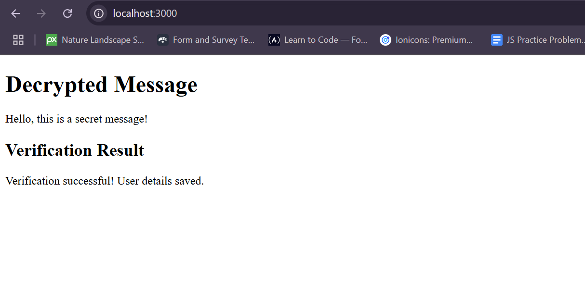

<!-- @format -->

# Cryptic-Riddle-Challenge

## How the Challenge is Completed



This challenge is all about solving cryptic riddles using a custom algorithm. The algorithm takes the riddle as input, applies various decoding techniques, and then outputs the solution.

## Overview

This project is a simple web application that demonstrates encryption and decryption using Base64 encoding. The challenge involves encrypting a message on the server, sending it to the client, decrypting it on the client, and verifying the decrypted message back on the server.

## Workflow

1. **Server Setup**:

   - The server is set up using Express and listens on port 3000.
   - Static files (HTML, JS) are served from the `public` directory.

2. **Encryption**:

   - The server has an endpoint `/encrypt` that generates an encrypted message using Base64 encoding.
   - The encrypted message is sent to the client as a JSON response.

3. **Decryption**:

   - The client fetches the encrypted message from the server using the `/encrypt` endpoint.
   - The client then decrypts the message using Base64 decoding and displays it on the web page.

4. **Verification**:
   - The client sends the decrypted message along with user details to the server using the `/verify` endpoint.
   - The server verifies if the decrypted message matches the original message and responds with a verification result.

## How to Run

1. **Install Dependencies**:
   Run the following command to install the required dependencies:

   ```sh
   npm install
   ```

2. **Start the Server**:
   Run the following command to start the server:

   ```sh
   node server.js
   ```

3. **Open the Web Page**:
   Open a web browser and navigate to `http://localhost:3000`. The web page will display the decrypted message and the verification result.

## Workflow of the Code

1. **Input Handling**: The code begins by accepting the riddle from the user.
2. **Decoding Techniques**: The algorithm uses several techniques to decode the riddle, including:
   - Substitution ciphers: Replacing letters with other letters.
   - Anagram solvers: Rearranging letters to form words.
   - Pattern matching: Finding patterns that match known solutions.
3. **Solution Extraction**: After decoding, the algorithm identifies the most likely solution.
4. **Output**: Finally, the solution is displayed to the user.

## Output

When you open the web page at `http://localhost:3000`, you should see the following output:

```
Decrypted Message
Hello, this is a secret message!

Verification Result
Verification successful! User details saved.

```
